# MRD-Wood

Multi-level Representation Drift for diagnosing and monitoring wood species recognition failures under domain shift.

This repository contains the code, processed CSV results, and paper figures for the MRD-Wood experiments. The manuscript studies frozen pretrained visual backbones for computer-vision wood identification under controlled perturbations, Tier-B external datasets, VN26 cross-magnification transfer, and label-free deployment monitoring.

## Main Findings

- Clean accuracy is not a reliable proxy for deployment robustness.
- DINOv2-B and EfficientNet-B3 are strongest under synthetic perturbations, while HRNet-32 has the highest clean accuracy.
- Paired feature drift is the strongest representation-level signal for accuracy degradation.
- The drift/drop relationship remains strong under external Tier-B validation.
- VN26 cross-magnification transfer exposes a separate scale-shift failure mode.
- RBF-MMD reference-bank monitoring detects batch-level failure without target labels.

## Key Results

| Result | Value |
|---|---:|
| Feature drift vs. accuracy drop | Pearson `r = 0.908`, Spearman `rho = 0.937` |
| Tier-B feature drift vs. drop | `r = 0.870` |
| Partial correlation after grouped controls | `r = 0.795` |
| RBF-MMD deployment monitor | ROC-AUC `0.968`, F1 `0.909` |
| Paired feature-drift oracle | ROC-AUC `0.976`, F1 `0.919` |
| VN26 x20 -> x50 transfer | Accuracy `0.160` |
| Negative-control deblur | accuracy `0.469 -> 0.297`, drift `0.488 -> 0.638` |

## Figures

### Robustness Under Perturbation

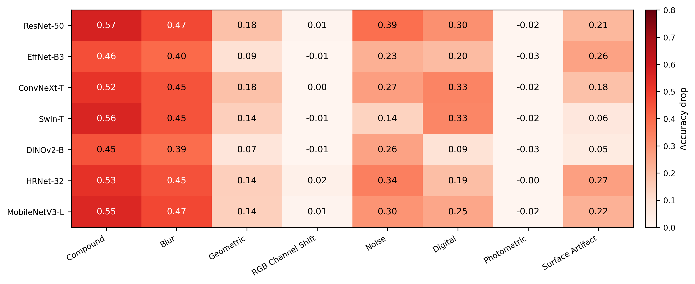

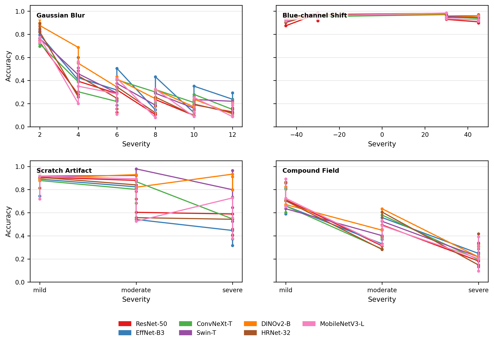

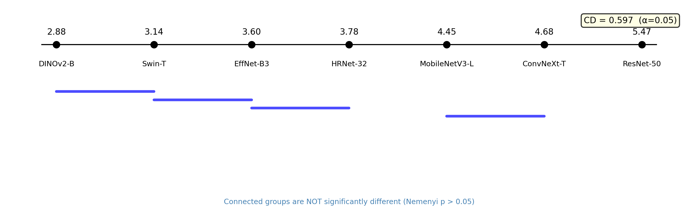

### Representation Drift and Failure

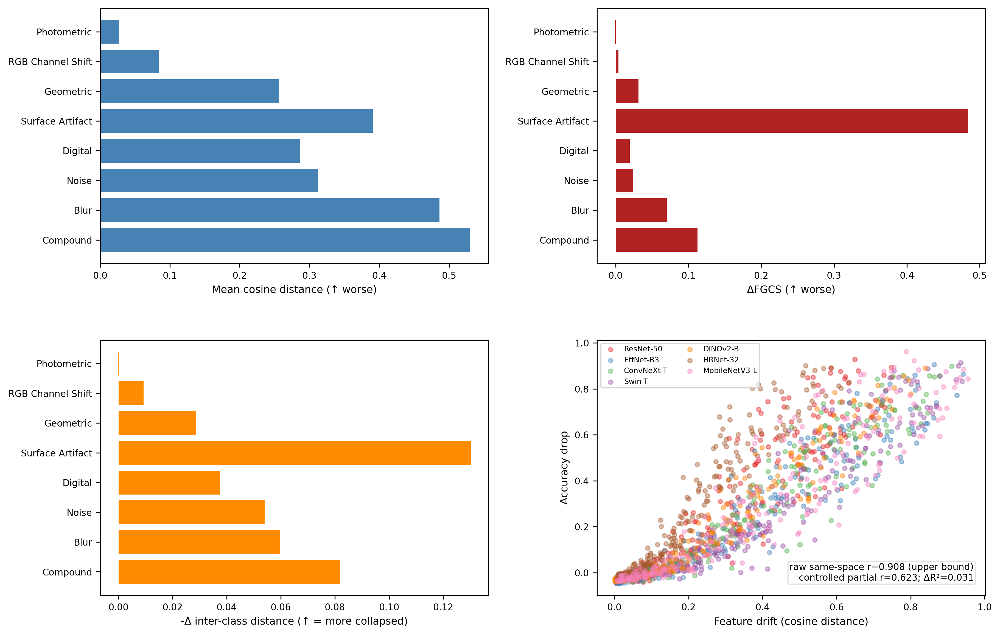

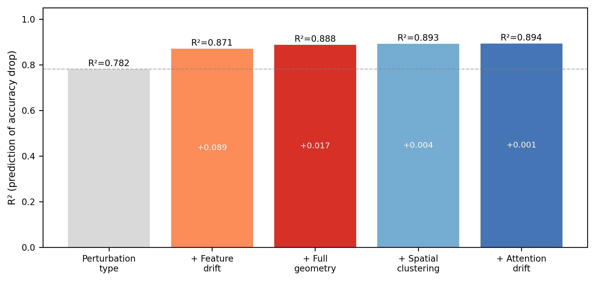

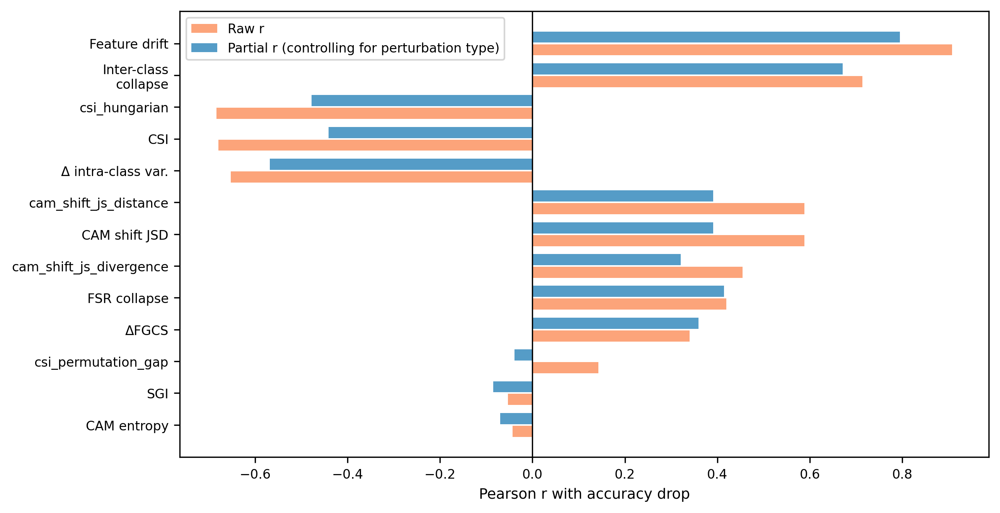

### Monitoring

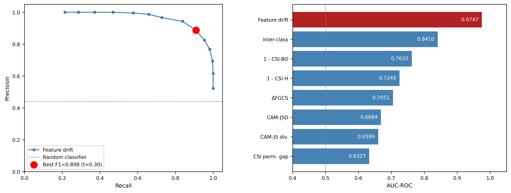

### External and Cross-Magnification Validation

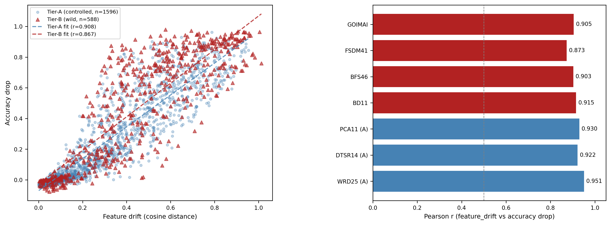

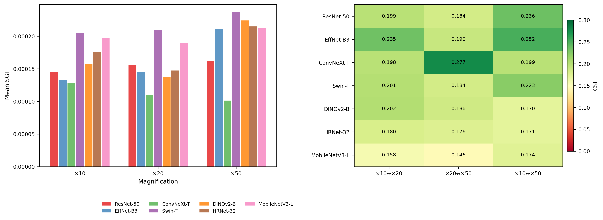

### Spatial and CAM Diagnostics

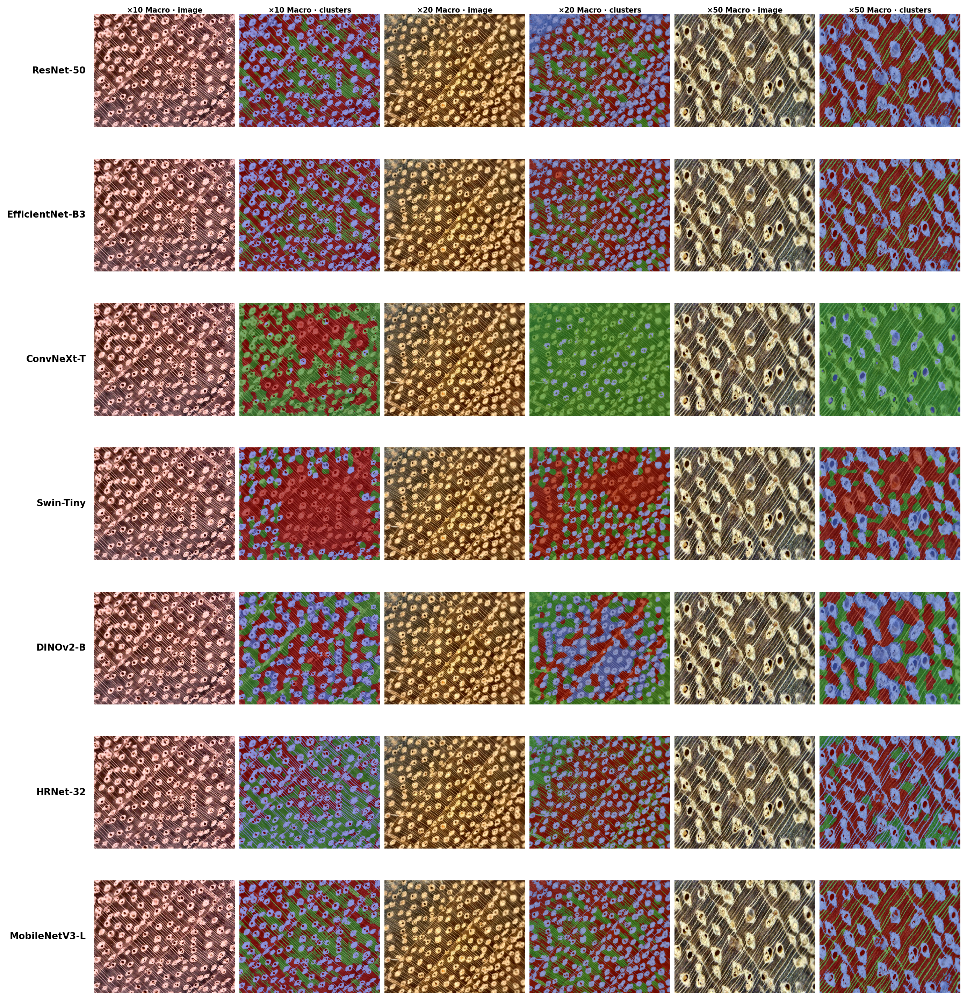

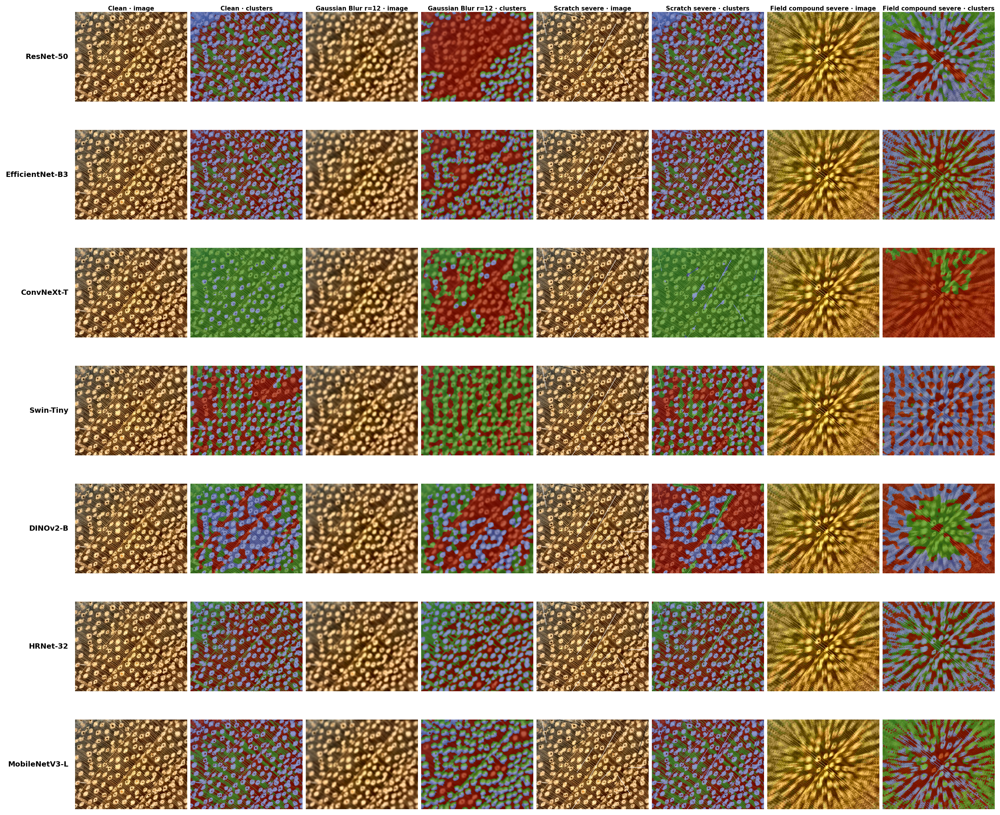

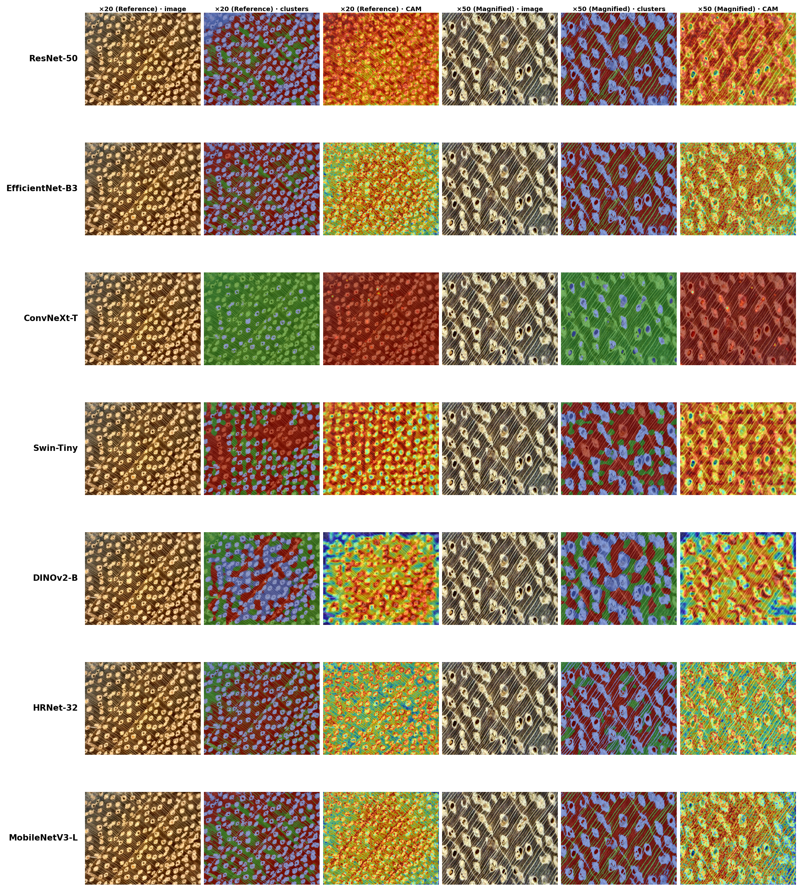

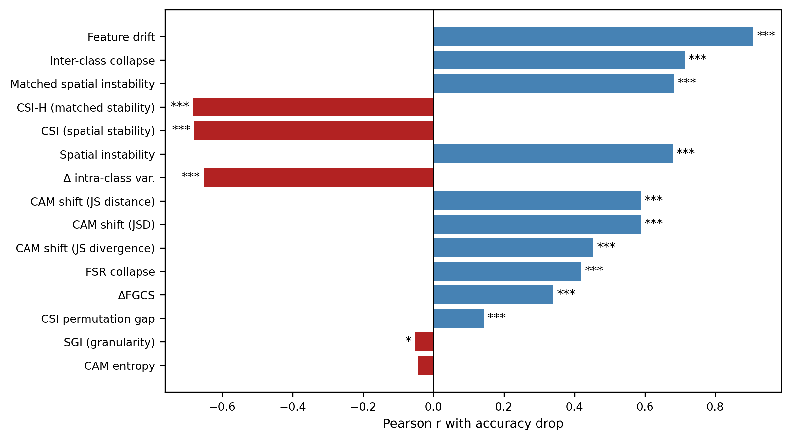

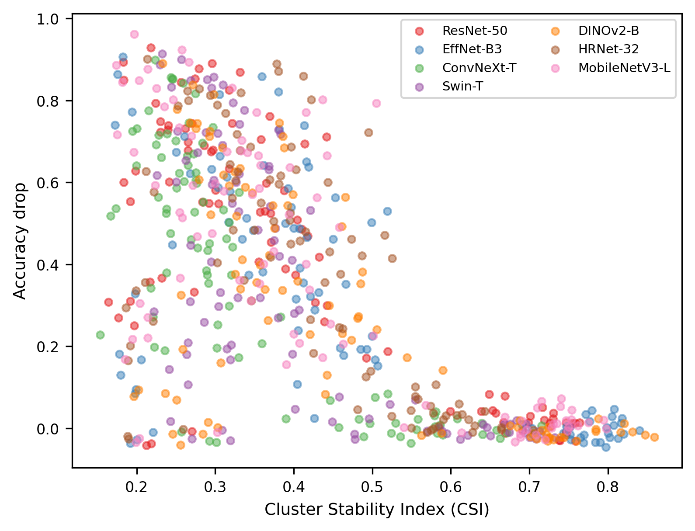

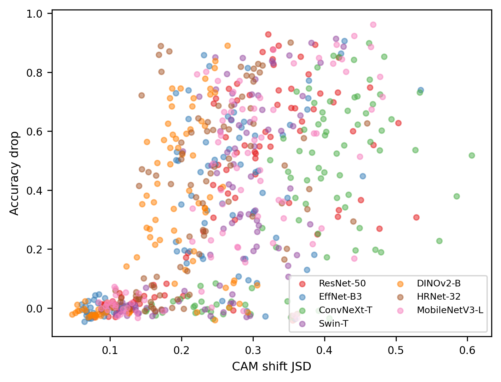

## Included Results

The repository keeps processed CSV and PNG outputs in:

```text
results/csv/
results/figures/
```

Large datasets, feature caches, model weights, LaTeX build artifacts, third-party binaries, downloaded archives, and PDFs are ignored by `.gitignore`.

## Setup

```bash
pip install -r requirements.txt
```

Dataset paths are configured through environment variables or JSON config files:

```bash
export WOOD_BASE=/path/to/workdir
export WOOD_DATASETS_DIR=/path/to/datasets
export WOOD_RESULTS_DIR=/path/to/results
```

## Full Colab Run

```bash
python scripts/run_full_colab.py \
  --config configs/full_colab_l4.json \
  --resume
```

To check whether expected outputs are present:

```bash
python scripts/check_full_run_outputs.py \
  --config configs/full_colab_l4.json \
  --results-dir results \
  --no-state
```

Expected current status:

```text
OK=105  WARN=0  FAIL=0
```

## Manuscript

The manuscript source is `main.tex`. Build locally with Tectonic if available:

```bash
./third_party/tectonic-musl/tectonic --keep-logs --keep-intermediates main.tex
```

The generated PDF is ignored by git; rebuild it locally when needed.
