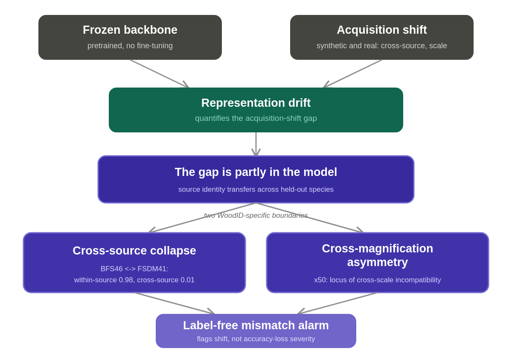
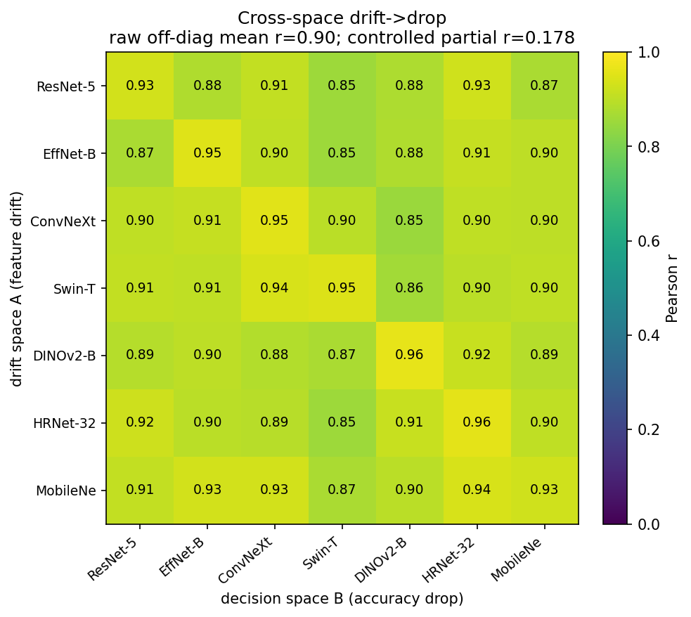
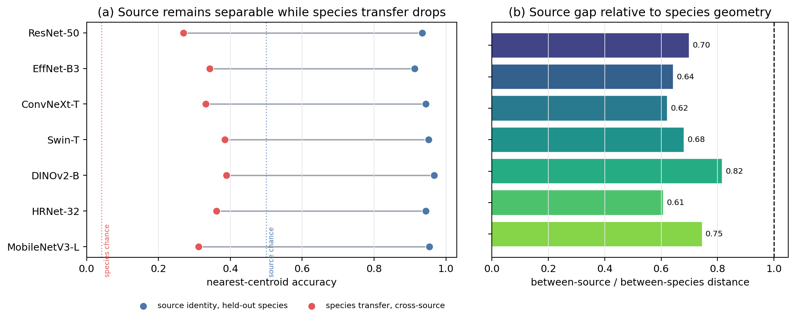
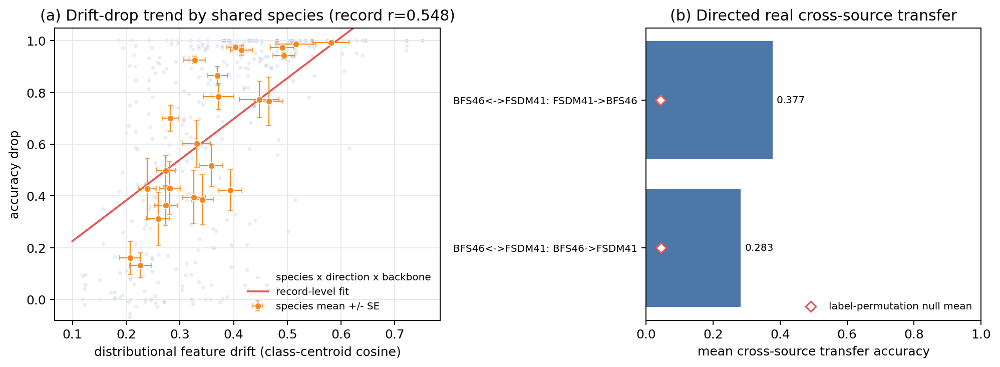
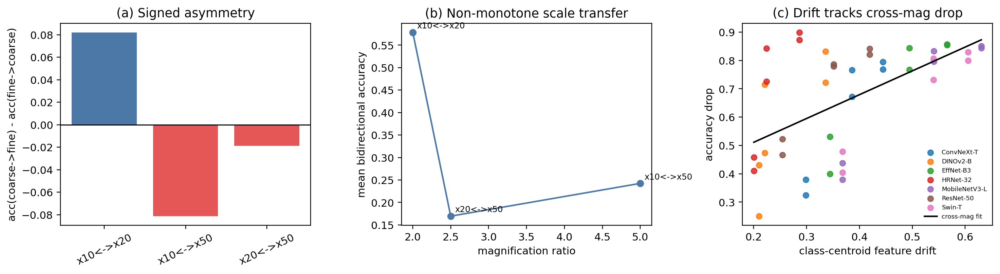
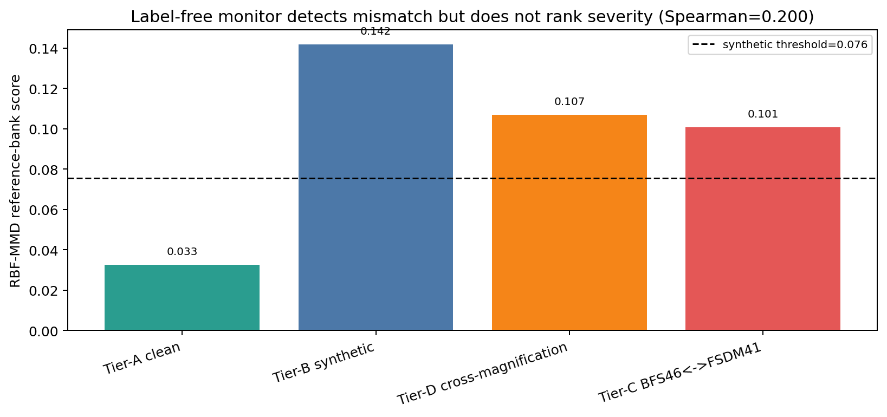
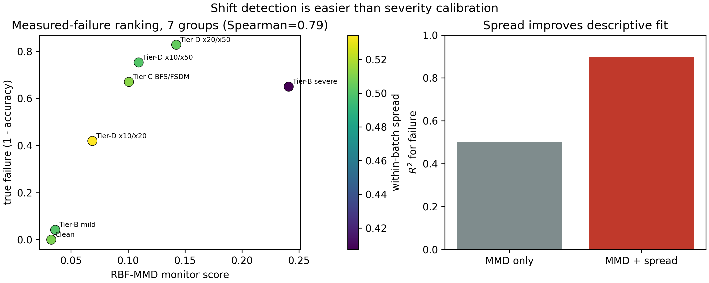
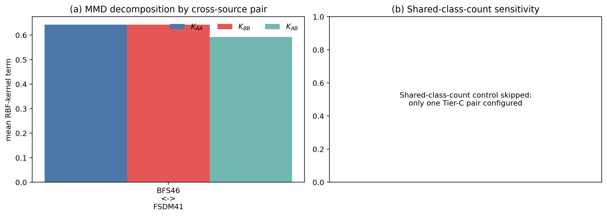
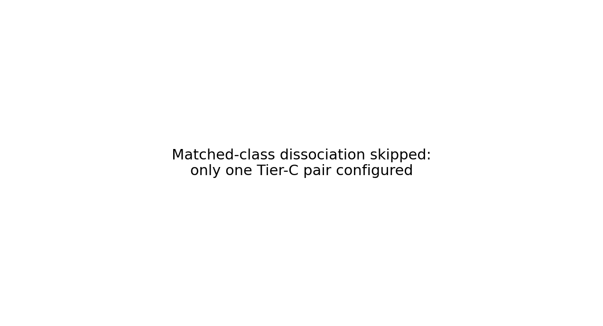

# MRD-Wood

Code and results for:

**When Wood Recognition Fails: Cross-Source and Cross-Magnification Boundaries of Acquisition Shift**

MRD-Wood (Mapping Representation Drift for Wood Recognition) is an empirical
diagnostic protocol for studying acquisition-shift failure in frozen visual
representations. It is not a new classifier or drift detector. The repository
contains the experiment package, processed CSV outputs, paper figures, and
manuscript source.



## Scope

The study evaluates seven pretrained backbones across four experimental tiers:

| Tier | Data | Role |
|---|---|---|
| A | WRD25, DTSR14, PCA11 | Paired synthetic perturbations and controlled drift analysis |
| B | BFS46, FSDM41, GOIMAI, WOODAUTH, BD11 | External-source validation under the same perturbation suite |
| C | BFS46/FSDM41, DTSR14/WOODAUTH | Real cross-source transfer over shared accepted species |
| D | VN26 x10/x20/x50 | Real cross-magnification transfer and asymmetry |

The evaluated backbones are ResNet-50, EfficientNet-B3, ConvNeXt-T, Swin-T,
DINOv2-B, HRNet-32, and MobileNetV3-L.

## Main Findings

- After controlling for dataset, backbone, perturbation family, and severity,
  feature drift retains a positive association with accuracy drop
  (`partial r = 0.623`, `Delta R2 = 0.031`).
- The transferable cross-space component is smaller (`partial r = 0.178`);
  pooled same-space `r = 0.908` is treated as an upper-bound association.
- Frozen features encode acquisition source more reliably than cross-source
  species identity.
- Shared-species transfer nearly collapses for BFS46/FSDM41
  (`accuracy = 0.008-0.013`) and remains limited for DTSR14/WOODAUTH.
- VN26 transfer is asymmetric and non-monotone across magnification pairs, with
  x50 as the main cross-scale failure locus.
- A standard reference-bank RBF-MMD monitor reaches batch-level
  `ROC-AUC = 0.968` and `F1 = 0.909` on synthetic shifts and flags 60/70
  real-shift batches. Its raw magnitude is an acquisition-mismatch score, not a
  calibrated estimate of accuracy loss.

## Selected Results

### Controlled Drift and Cross-Space Checks




### Real Cross-Source Shift





### Cross-Magnification Shift



### Label-Free Monitoring and Its Limits










## Repository Layout

```text
wood_spatial/
  experiments/       Reproducible experiment modules
  figures/           Paper-figure generation
scripts/
  run_full_colab.py  End-to-end Colab runner
  check_full_run_outputs.py
configs/
  full_colab_l4.json
results/
  csv/               Processed numerical outputs tracked by git
  figures/           PNG figures tracked by git
main.tex             Manuscript source
references.bib       Bibliography
```

Datasets, feature caches, model weights, `results_v4/`, LaTeX build artifacts,
third-party binaries, and generated experiment PDFs are excluded by
`.gitignore`. The tracked `main.pdf` is a manuscript snapshot.

## Setup

```bash
pip install -r requirements.txt
```

Configure local paths with environment variables:

```bash
export WOOD_BASE=/path/to/workdir
export WOOD_DATASETS_DIR=/path/to/datasets
export WOOD_RESULTS_DIR=/path/to/results
```

The Colab profile uses paths defined in `configs/full_colab_l4.json`.

## Run Experiments

Full resumable Colab run:

```bash
python scripts/run_full_colab.py \
  --config configs/full_colab_l4.json \
  --resume
```

Run selected stages:

```bash
python scripts/run_full_colab.py \
  --config configs/full_colab_l4.json \
  --only exp_tierc_cross_source \
         exp_source_vs_species_probe \
         exp_monitor_on_real_shift
```

Validate Tier-C species overlap and caches before the real run:

```bash
python -u -m wood_spatial.experiments.exp_tierc_cross_source_shift \
  --check-only
```

Check expected outputs:

```bash
python scripts/check_full_run_outputs.py \
  --config configs/full_colab_l4.json \
  --no-paper-figures \
  --show-ok
```

## Manuscript

Build with the bundled Tectonic binary when available:

```bash
./third_party/tectonic-musl/tectonic \
  --keep-logs \
  --keep-intermediates \
  main.tex
```

The manuscript uses the Elsevier CAS single-column template. Generated PDFs are
not required to reproduce the numerical results.
