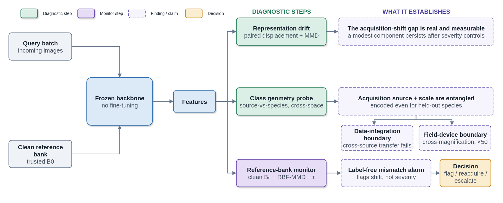

# MRD-Wood

Code and results for:

**When Wood Recognition Fails: Cross-Source and Cross-Magnification Boundaries of Acquisition Shift**

MRD-Wood (Mapping Representation Drift for Wood Recognition) is an empirical
diagnostic protocol for studying acquisition-shift failure in frozen visual
representations. It is not a new classifier or drift detector. The repository
contains the experiment package, processed CSV outputs, and paper figures.



## Scope

The study evaluates seven pretrained backbones across four experimental tiers:

| Tier | Data | Role |
|---|---|---|
| A | WRD25, DTSR14, PCA11 | Paired synthetic perturbations and controlled drift analysis |
| B | BFS46, FSDM41, GOIMAI, BD11 | External-source validation under the same perturbation suite |
| C | BFS46/FSDM41 | Real cross-source transfer over 24 shared accepted species |
| D | VN26 x10/x20/x50 | Real cross-magnification transfer and asymmetry |

The evaluated backbones are ResNet-50, EfficientNet-B3, ConvNeXt-T, Swin-T,
DINOv2-B, HRNet-32, and MobileNetV3-L.

## Main Findings

- Over all 1,596 Tier-A records, feature drift retains a positive association
  with accuracy drop after dataset, backbone, perturbation-family, and severity
  controls (`partial r = 0.623`, `Delta R2 = 0.048`). The fixed 630-record
  spatial/CAM subset gives `partial r = 0.552` and `Delta R2 = 0.032` as a
  secondary diagnostic analysis.
- The transferable cross-space component is smaller (`partial r = 0.178`);
  pooled same-space `r = 0.908` is treated as an upper-bound association.
- A balanced leave-one-species-out probe recovers acquisition source at
  `0.944` accuracy for BFS46/FSDM41 (binary chance `0.5`), while cross-source
  species recognition remains much lower (`0.342` mean accuracy). This exposes
  a class-conditional gap within a source-sensitive marginal representation.
- Shared-species transfer is strongly degraded and asymmetric for BFS46/FSDM41
  (`0.283` for BFS46 -> FSDM41 and `0.377` for FSDM41 -> BFS46), but remains
  above the deterministic label-permutation null in all 14 backbone-direction
  cells.
- VN26 transfer is asymmetric and non-monotone across magnification pairs, with
  x50 as the main cross-scale failure locus.
- A standard reference-bank RBF-MMD monitor reaches batch-level
  `ROC-AUC = 0.969` and `F1 = 0.909` on 3,724 synthetic-shift records and flags
  47/56 real-shift batches. Its raw magnitude detects acquisition mismatch but does
  not rank class-conditional failure reliably across heterogeneous sources.

## Selected Results

### Controlled Drift and Cross-Space Checks


### Real Cross-Source Shift


### Cross-Magnification Shift


### Label-Free Monitoring and Its Limits


The monitoring controls separate two roles that should not be conflated:
thresholded RBF-MMD is evaluated as a binary acquisition-mismatch alarm, whereas
raw MMD magnitude is tested and rejected as a universal accuracy-loss scale.

## Repository Layout

```text
wood_spatial/
  experiments/       Reproducible experiment modules
  figures/           Paper-figure generation
scripts/
  run_full_colab.py  End-to-end Colab runner
  check_full_run_outputs.py
configs/
  full_colab_l4.json
results/
  csv/               Processed numerical outputs tracked by git
  figures/           PNG figures tracked by git
  audit/             Machine-readable paper/CSV consistency audit
references.bib       Bibliography
```

Datasets, feature caches, model weights, `results_v4/`, LaTeX build artifacts,
third-party binaries, manuscript PDFs, and generated experiment PDFs are
excluded by `.gitignore`.

## Setup

```bash
pip install -r requirements.txt
```

Configure local paths with environment variables:

```bash
export WOOD_BASE=/path/to/workdir
export WOOD_DATASETS_DIR=/path/to/datasets
export WOOD_RESULTS_DIR=/path/to/results
```

The Colab profile uses paths defined in `configs/full_colab_l4.json`.

## Run Experiments

Full resumable Colab run:

```bash
python scripts/run_full_colab.py \
  --config configs/full_colab_l4.json \
  --resume
```

Run selected stages:

```bash
python scripts/run_full_colab.py \
  --config configs/full_colab_l4.json \
  --only exp_tierc_cross_source \
         exp_source_vs_species_probe \
         exp_monitor_on_real_shift
```

Run the real-shift and class-conditional monitoring controls:

```bash
python scripts/run_full_colab.py \
  --config configs/full_colab_l4.json \
  --only exp5_crossmag_asymmetry \
         exp_tierc_cross_source \
         exp_source_vs_species_probe \
         exp_monitor_on_real_shift \
         exp_monitor_severity_dissociation \
         exp_mmd_gamma_sensitivity \
         exp_mmd_confound_and_sign \
         exp_matched_class_dissociation
```

Validate Tier-C species overlap and caches before the real run:

```bash
python -u -m wood_spatial.experiments.exp_tierc_cross_source_shift \
  --check-only
```

The real Tier-C run also computes a deterministic 10,000-permutation label null
for every backbone and directed source pair. Export the exact pretrained
configuration resolved by the pinned timm version with:

```bash
python3 scripts/export_backbone_manifest.py
```

The manifest records the environment used to resolve the model registry. The
paper's reproducibility environment is pinned separately in
`requirements.txt`; the model identifiers and pretrained tags must match even
when the manifest is exported with a newer compatible timm release.

The source-versus-species stage reports both balanced held-out-image accuracy
and a stricter leave-one-species-out source probe; the latter is the manuscript
protocol.

Check expected outputs:

```bash
WOOD_RESULTS_DIR=results \
python scripts/check_full_run_outputs.py \
  --config configs/full_colab_l4.json \
  --no-paper-figures \
  --show-ok
```

Omit `WOOD_RESULTS_DIR=results` on Colab when the configured results directory is
the intended target.

Audit the numerical claims used by the paper:

```bash
python scripts/audit_paper_results.py --strict --write-report
```

The audit distinguishes condition-level and batch-level AUCs, controlled and
pooled correlations, capped alarm scores, full-feature MMD magnitudes, and
shared-bandwidth sensitivity checks. Its canonical metric registry is written
to `results/audit/paper_metric_registry.csv`. Outputs are moved to
`results/archive/` only when they are verified to come from a superseded
formula, configuration, cache, or protocol.

The submission snapshot passes the strict paper audit with 123 checked claims
and no warnings or failures.

## Manuscript

Manuscript TeX/PDF snapshots are intentionally not tracked on `main`. The
repository tracks the reproducible experiment code, processed numerical outputs,
paper figures, and audit reports needed to verify the reported results.
